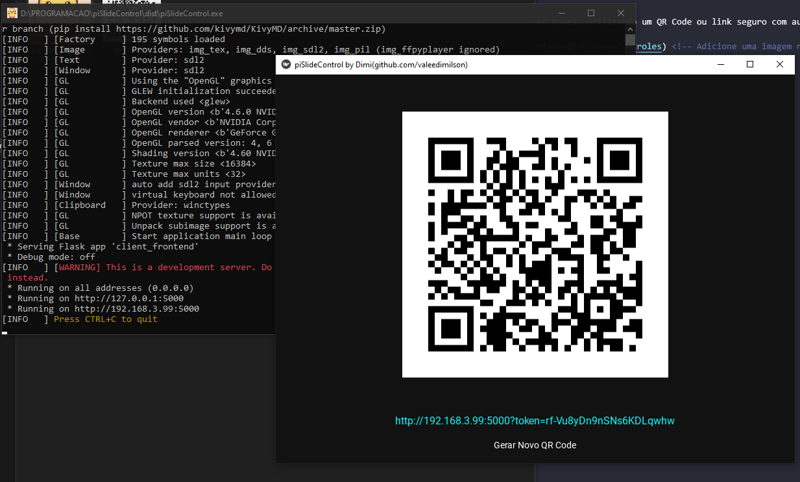
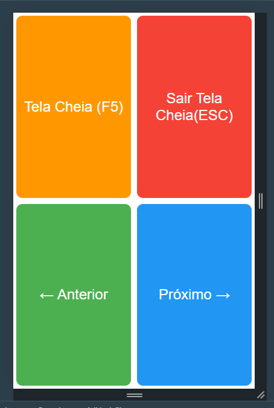

```markdown
# piSlideControl

Controle apresentações de slides remotamente via navegador ou dispositivo móvel, utilizando um QR Code ou link seguro com autenticação por token.




## ✨ Funcionalidades
- Controle slides (Anterior/Próximo)
- Entrar/Sair do modo tela cheia
- Geração dinâmica de QR Code
- Autenticação por token seguro
- Interface cross-platform
- Registro de dispositivos conectados

## ⚙️ Requisitos
- Python 3.7+
- Sistema Operacional: Windows/macOS
- Aplicativo de apresentação (PowerPoint, LibreOffice Impress, etc)

## 🚀 Instalação
1. Clone o repositório:
   ```bash
   git clone https://github.com/valeedimilson/piSlideControl.git
   ```

2. Crie o ambiente virtual do python:
   ```bash
   python -m venv piSlideControl
   ```

3. Inicie o ambiente virtual do python:
   ```bash
   cd piSlideControl
   Scripts\activate
   ```   

4. Instale as dependências:
   ```bash
   pip install -r requirements.txt
   ```

## 🖥️ Uso
1. Execute o aplicativo:
   ```bash
   python main.py
   ```

2. Escaneie o QR Code ou clique no link exibido

3. Controles disponíveis:
   - ← Anterior (Tecla Left/Space)
   - → Próximo (Tecla Right)
   - 🖵 Tela Cheia (F5)
   - 🚪 Sair da Tela Cheia (ESC)

4. Gere novos tokens quando necessário usando o botão "Gerar Novo QR Code"

## 📦 Build Executável
Para criar uma versão standalone:
```bash
pyinstaller --clean --onefile --noconsole --icon=icon.ico --name piSlideControl --strip main.py --add-data "icon.ico;."
```

## ⚠️ Notas Importantes
- Mantenha o aplicativo de apresentação(power point, wps office, libre office) em primeiro plano durante o uso
- Em macOS, pode ser necessário conceder permissões de acessibilidade
- Tokens expiram ao gerar um novo QR Code
- Firewalls devem permitir a porta 5000

## 🤝 Contribuição
Contribuições são bem-vindas! Siga estes passos:
1. Fork o projeto
2. Crie sua branch (`git checkout -b feature/nova-funcionalidade`)
3. Commit suas mudanças (`git commit -m 'Adiciona nova funcionalidade'`)
4. Push para a branch (`git push origin feature/nova-funcionalidade`)
5. Abra um Pull Request

## 📄 Licença
Distribuído sob licença MIT. Veja `LICENSE` para mais informações.

---
Desenvolvido por [Dimi (valeedimilson)](https://github.com/valeedimilson)  
🔗 Baseado em tecnologias Python: Flask, KivyMD e PyAutoGUI
```